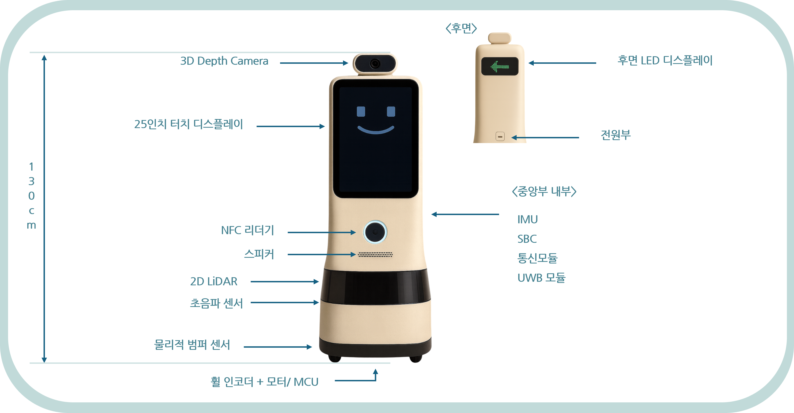

# Check-Up Guide Robot

This project proposes a ROS2-based autonomous robot designed to guide patients in large-scale medical check-up centers.  
It is currently at the system planning and design stage, with simulation implementation planned.

## Project Overview

- Goal: Reduce congestion and improve navigation experience in health screening centers
- Functionality:
  - Personalized route guidance via UWB wristbands
  - Real-time screen + voice instructions
  - Autonomous elevator riding and floor transitions
  - Sensor fusion-based obstacle avoidance

## Hardware and Design

- MCU: Dual structure (SBC + STM32 or Jetson + MCU)
- Sensors:
  - 2D LiDAR (RPLIDAR S1)
  - Depth camera (Intel RealSense D455)
  - IMU (BNO085)
  - UWB Module (e.g., DWM3000)
  - NFC reader (wristband authentication)
  - Ultrasonic sensors, bumpers, encoders
- Display: 25-inch touchscreen + LED direction panel
- Power: DC input + wireless charging for wristbands

Design Notes:
- Designed for multi-floor indoor spaces (~5,000㎡)
- Wristband tracks individual patients using UWB
- Interface optimized for elderly and foreign patients

## Software Components

- ROS2: Navigation2 stack with Cartographer SLAM
- Wristband Tracking: NFC user identification + UWB distance tracking
- Position Estimation: Kalman filter smoothing
- Elevator Interface: V2I (Vehicle-to-Infrastructure) simulation planned
- Simulation: Gazebo + hospital world (planned)

## Algorithms Used

| Function               | Algorithm                     |
|------------------------|-------------------------------|
| Mapping & Localization | Cartographer (SLAM)           |
| Global Planning        | A*                            |
| Local Planning         | DWB (Dynamic Window Approach) |
| Wristband Tracking     | UWB + Kalman Filter           |
| Fail-Safe Navigation   | Predictive dead zone handling |

---

## 건강검진 안내 자율주행 로봇

본 프로젝트는 대형 건강검진센터에서 환자에게 **개인 맞춤형 길 안내**를 제공하는 ROS2 기반 자율주행 로봇 설계안입니다.  
현재는 시스템 기획 단계이며, 시뮬레이션 기반 구현이 예정되어 있습니다.

### 프로젝트 개요

- 목표: 대기 혼잡 완화 및 고령자·외국인 대상 실내 내비게이션 제공
- 기능:
  - UWB/NFC 손목밴드를 통한 환자 식별 및 개별 안내
  - 터치스크린 + 음성을 통한 실시간 안내
  - 엘리베이터 탑승 포함한 자율주행
  - 센서 융합 기반 장애물 회피

### 하드웨어 및 설계

- MCU 구조: SBC(Master) + MCU(Slave) 또는 Jetson + STM32 구조
- 센서 구성:
  - 2D LiDAR (RPLIDAR S1)
  - 3D 카메라 (RealSense D455)
  - IMU (BNO085)
  - UWB 모듈 (DWM3000 등)
  - NFC 리더기 (팔찌 인증)
  - 초음파 센서, 범퍼, 엔코더 등
- 디스플레이: 25인치 터치스크린 + 후면 LED 패널
- 전원: DC 입력 + 손목밴드 무선 충전

설계 특징:
- 약 5,000㎡ 규모의 다층 실내 환경을 고려
- 팔찌 기반 사용자 추적 시스템
- 고령자 및 외국인에 최적화된 UI 구성

### 소프트웨어 구성

- ROS2: Navigation2 + Cartographer SLAM
- 손목밴드 추적: NFC 인증 + UWB 거리 추적
- 위치 추정: 칼만 필터 기반 보정
- 엘리베이터 연동: V2I 통신 (시뮬레이션 예정)
- 시뮬레이션 환경: Gazebo 병원 맵 구축 예정

### 적용 알고리즘

| 기능                    | 적용 알고리즘                 |
|-------------------------|------------------------------|
| SLAM                    | Cartographer                 |
| 전역 경로 계획         | A*                           |
| 지역 경로 계획         | DWB (Dynamic Window Approach)|
| 손목밴드 위치 추적     | UWB + 칼만 필터              |
| 음영구간 대응 주행     | 예측 기반 Fail-safe 모드     |

